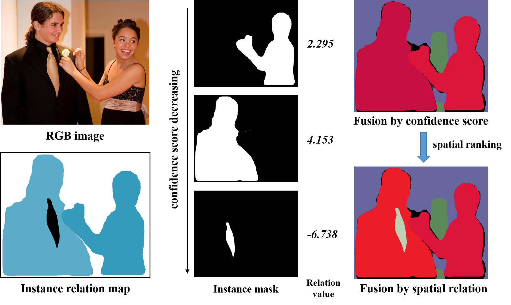
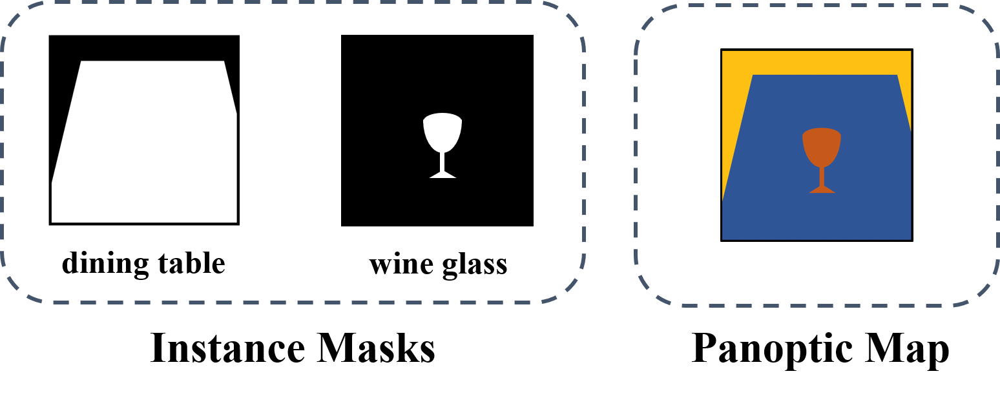

# Relation Aware Panoptic Segmentation in PyTorch 1.0

We extend the [maskrcnn-benchmark]( https://github.com/facebookresearch/maskrcnn-benchmark ) to implement the relation aware panoptic segmentation models in PyTorch 1.0.

<a href="url"></a>

## Highlights

- **Panoptic FPN**: We implement the Panoptic Feature Pyramid Network (FPN) in PyTorch 1.0.
- **Relation Aware Panoptic (RAP) Network**: We implement the relation aware panoptic segmentation network for resolving instance conflicts during the fusion.
- **New Fusion Strategy**: A new fusion method incorporating relation aware module and two overlapping area ratio check strategies.
- **Implement OCFusion**: We also implement an occluded head described in OCFusion for comparison.
- **Multi-GPU training and inference**
- **Pre-trained models**: We provide pre-trained checkpoints for panoptic FPN and RAP with all backbones on COCO dataset.

## Installation

Check [INSTALL.md](INSTALL.md) for installation instructions.

## Data Preparation (COCO)

Please first download the COCO panoptic segmentation dataset. And you will have RGB images and the corresponding original annotations. Next we specify how to prepare annotations for each segmentation task.

### Panoptic segmentation annotations

COCO provides `panoptic_train2017.json` and `panoptic_val2017.json` annotations as well as corresponding `.png` images for panoptic segmentation task. Each segment (either thing or stuff) has an unique id in `.json` file and is colored as [R,G,B] in the `.png` image, where  **id=R+G\*256+B\*256^2**.  More information can be found [here](http://cocodataset.org/#format-data).

For panoptic segmentation annotations, **no post-process is needed.** 

### Instance segmentation annotations

For instance segmentation task, two annotation files are directly provided (`instances_train2017.json`, `instances_val2017.json`). Furthermore, we should extract the ground truth data for occluded instance relations.

#### Instance Relations

Given an image with its corresponding instance masks and panoptic segmentation map as follows, we can find that the overlapping pixels are assigned to the wine glass in the panoptic ground truth map. Therefore, an instance relation that "the wine glass is closer than the dining table" can be extracted.

<a href="url"></a>

#### Scripts

Here we provide **two scripts** in `datasets/coco` to extract all these relations based on different overlapping threshold. Run these two scripts in the following order.

1. `retrieve_relation.py` Read panoptic and instance segmentation ground truth to produce a `.pkl` file that contains all occluded instance pairs.

2. `refine_instance_json_file.py` Refine the `.json` file by adding a field (`overlap`) for each object to store a list of instance ids. Instances in these list are all have significant overlap with this object and is on top of (or in front of) it.

#### Refined files

Also you can **directly download** the refined instance segmentation annotation files at [train_relation.json](https://drive.google.com/file/d/14WMaRJDvUYwrsQjqFAOj5sifQbv6DLka/view?usp=sharing) and [val_relation.json](https://drive.google.com/file/d/1mxte7dergtjNtvATTiHImDmP11XrRyBi/view?usp=sharing) (overlapping ratio is 0.2).

### Semantic segmentation annotations

For semantic segmentation task in COCO panoptic benchmark, there are only 53 stuff categories are used. Since no semantic annotations are provided, [panopticapi](https://github.com/cocodataset/panopticapi) provides a [script]( https://github.com/cocodataset/panopticapi/blob/master/converters/panoptic2semantic_segmentation.py ) to translate panoptic segmentation into semantic segmentation. 

Here we also provide a script to **regard all instance categories as a whole** (Same as Panoptic FPN). Scripts are in the `datasets/coco/` directory. 

```
panoptic2semantic_segmentation.py
panoptic2semantic_segmentation_pfpn_style.py
```

In this way, the annotations for semantic segmentation task is save as `.png` images in `annotations/semantic_train2017` and `annotations/semantic_val2017`.

### Symlink

**Use symlink the path to the coco dataset to `datasets/` as follows**

```bash
# COCO 
ln -s /path_to_coco_dataset/annotations datasets/coco/annotations
ln -s /path_to_coco_dataset/train2017 datasets/coco/images/train2017
ln -s /path_to_coco_dataset/test2017 datasets/coco/images/test2017
ln -s /path_to_coco_dataset/val2017 datasets/coco/images/val2017
```

In the `annotations` directory, there are

```
instances_train2017_with_relation.json     # annotations for instance segmentation with relations
instances_val2017_with_relation.json       # annotations for instance segmentation with relations
panoptic_train2017.json      # annotations for panoptic segmentation
panoptic_val2017.json        # annotations for panoptic segmentation
--panoptic_train2017         # annotated images as panoptic way
--panoptic_val2017           # annotated images as panoptic way
--semantic_train2017         # annotated images as semantic way
--semantic_val2017           # annotated images as semantic way
```

To configure your own paths to the datasets, please follow the instruction in [maskrcnn-benchmark]( https://github.com/facebookresearch/maskrcnn-benchmark ).

## Perform training on COCO dataset

For the following examples to work, you need to first install `RAP`. 

### Step 1: Training Panoptic FPN 

#### Single GPU training

**1. Run the following without modifications**

```bash
python /path_to_RAP/tools/train_net.py --config-file "/path/to/config/file.yaml"
```
we set in the configuration files a global batch size that is divided over the number of GPUs. So if we only
have a single GPU, this means that the batch size for that GPU will be 8x larger, which might lead
to out-of-memory errors.

**2. Modify the cfg parameters**

If you experience out-of-memory errors, you can reduce the global batch size. But this means that
you'll also need to change the learning rate, the number of iterations and the learning rate schedule.

Here is an example for Panoptic FPN R-50 with the 1x schedule:
```bash
python tools/train_net.py --config-file "configs/e2e_panoptic_rcnn_R_50_FPN_1x.yaml" SOLVER.IMS_PER_BATCH 2 SOLVER.BASE_LR 0.0025 SOLVER.MAX_ITER 1200000 SOLVER.STEPS "(640000, 960000)" TEST.IMS_PER_BATCH 1
```
This follows the [scheduling rules from Detectron.](https://github.com/facebookresearch/Detectron/blob/master/configs/getting_started/tutorial_1gpu_e2e_faster_rcnn_R-50-FPN.yaml#L14-L30)
Note that we have multiplied the number of iterations by 8x (as well as the learning rate schedules),
and we have divided the learning rate by 8x.

Since we set `MODEL.RPN.FPN_POST_NMS_PER_BATCH` to `False` during training， `MODEL.RPN.FPN_POST_NMS_TOP_N_TRAIN` is no need to change then. See [#672](https://github.com/facebookresearch/maskrcnn-benchmark/issues/672) for more details.

#### Multi-GPU training (recommended)

We use internally `torch.distributed.launch` in order to launch multi-gpu training. This utility function from PyTorch spawns as many Python processes as the number of GPUs we want to use, and each Python
process will only use a single GPU.

```bash
export NGPUS=8
python -m torch.distributed.launch --nproc_per_node=$NGPUS tools/train_net.py --config-file "configs/e2e_panoptic_rcnn_R_50_FPN_1x.yaml" 
```
### Step 2: Finetune the Relation Aware Head

To finetune the relation aware head, we use the same operations as baseline models except for **the  changing config file to that with `fintune` suffix.** Here is an example for Panoptic FPN R_50 relation finetune. 

```bash
export NGPUS=8
python -m torch.distributed.launch --nproc_per_node=$NGPUS tools/train_net.py --config-file "configs/e2e_panoptic_rcnn_R_50_FPN_1x_relation_finetune.yaml"
```

## Evaluation

You can test your model directly on single or multiple gpus. 

**Note that the batch size should be equal to the GPU number.** Because semantic branch result is influenced by the multi-image test.

Here is an example for R-50-FPN with the 1x schedule on 8 GPUS:

```bash
export NGPUS=8
python -m torch.distributed.launch --nproc_per_node=$NGPUS tools/test_net.py --config-file "configs/e2e_panoptic_rcnn_R_50_FPN_1x.yaml" TEST.IMS_PER_BATCH 8
```
#### Checkpoints

Here is an example to use our provided checkpoints (list in the next section) for testing.

1. Download checkpoint (`R_50.pkl`) to `/path_to_RAP/output_coco_panoptic_R_50/`. The directory name should be the same as `OUTPUT_DIR` in `configs/e2e_panoptic_rcnn_R_50_FPN_1x.yaml` 

2. create a file named `last_checkpoint` in `/path_to_RAP/output_coco_panoptic_R_50/` with content as below

   ```
   output_coco_panoptic_R_50/R_50.pkl
   ```

3. Then follow the evaluation instructions. run 

   ```
   python -m torch.distributed.launch --nproc_per_node=8 tools/test_net.py --config-file "configs/e2e_panoptic_rcnn_R_50_FPN_1x.yaml" TEST.IMS_PER_BATCH 8
   ```

## Model Zoo and Baselines

### Hardware

- 8 NVIDIA P40 GPUs (24GB)

### Software

- PyTorch version: 1.0.0.dev20190328
- CUDA 9.0
- CUDNN 7.4

### Panoptic FPN baselines

Here are two mainly difference compared with the original paper training strategy.

1. The deepest FPN level in the semantic segmentation branch is at 1/64 scale.
2. We train more time (150K) than Mask R-CNN does (90K).

| backbone                              | PQ   | SQ   | RQ   | PQ-Thing | PQ-Stuff | checkpoint |
| ------------------------------------- | ---- | ---- | ---- | -------- | -------- | ---------- |
| R-50-FPN                              | 40.0 | 78.0 | 49.1 | 46.2     | 30.5     | [R_50.pth](https://drive.google.com/file/d/1ti11kBbx7DDPXiQQ11etB_MVkBQDqRd_/view?usp=sharing) |
| R-101-FPN                             | 41.4 | 79.5 | 50.7 | 47.8     | 31.7     | [R_101.pth](https://drive.google.com/file/d/1unJwLksV4MaCm3jNwfamdEzr4vhZ4HS9/view?usp=sharing) |
| X-101-32x8d-FPN                       | 43.4 | 79.1 | 53.0 | 50.1     | 33.2     | [X_101.pth](https://drive.google.com/file/d/1fO_coFGPXYelD9lHtfsmP1jGCRpTNGUF/view?usp=sharing) |
| X-152-32x8d-FPN                       | 44.6 | 79.6 | 54.2 | 51.7     | 33.8     | [X_152.pth](https://drive.google.com/file/d/1LpeobVTR2PCg-qK-b4QEs3PWRnVIsiTG/view?usp=sharing) |
| X-152-32x8d-FPN (w/ deformable conv.) | 47.0 | 81.0 | 56.9 | 53.4     | 37.4     | [X_152_dcn.pth](https://drive.google.com/file/d/1uzp_OUUPNrgE0_wCRGukZxZ_h6Zocps0/view?usp=sharing) |

### RAP baselines

| backbone                              | PQ   | SQ   | RQ   | PQ-Thing | PQ-Stuff | checkpoint |
| ------------------------------------- | ---- | ---- | ---- | -------- | -------- | ---------- |
| R-50-FPN                              | 41.8 | 78.1 | 51.3 | 49.2     | 30.5     | [R_50_RAP.pth](https://drive.google.com/file/d/1WxIqoWmYSOqhbmEcbbkS_UI1-qxJwa3N/view?usp=sharing) |
| R-101-FPN                             | 43.3 | 79.6 | 53.0 | 50.9     | 31.8     | [R_101_RAP.pth](https://drive.google.com/file/d/1w7Q9sQ1TGIjyBt0K2IO6uFOXSI6Sb0to/view?usp=sharing) |
| X-101-32x8d-FPN                       | 45.7 | 79.2 | 55.8 | 53.9     | 33.3     | [X_101_RAP.pth](https://drive.google.com/file/d/1jVm_xI6kcS8W8uNWG7jXqA7FjXoBSN7v/view?usp=sharing) |
| X-152-32x8d-FPN                       | 46.9 | 79.7 | 57.0 | 55.5     | 33.9     | [X_152_RAP.pth](https://drive.google.com/file/d/1ZO10CSG1kpRrgpe84r6EQ5JEoQZGV_3M/view?usp=sharing) |
| X-152-32x8d-FPN (w/ deformable conv.) | 49.4 | 81.3 | 59.6 | 57.2     | 37.5     | [X_152_dcn_RAP.pth](https://drive.google.com/file/d/1X89Q0M7wu8yr5Uddw4ml5gzS54Lr8xvd/view?usp=sharing) |

#### RAP with OCFusion-style occluded head
| backbone                              | PQ   | SQ   | RQ   | PQ-Thing | PQ-Stuff | checkpoint |
| ------------------------------------- | ---- | ---- | ---- | -------- | -------- | ---------- |
| R-50-FPN                              | 40.7 | 77.9 | 50.2 | 47.5     | 30.5     | [R_50_ocfusion.pth](https://drive.google.com/file/d/1Ue22ocgFQE4Yadub8iwO7oSWiPJ3fVOU/view?usp=sharing) |
| R-101-FPN                             | 42.5 | 79.4 | 52.2 | 49.6     | 31.9     | [R_101_ocfusion.pth](https://drive.google.com/file/d/1lUWxaQyEjR8ELZxNAxb2iMXbUQguy094/view?usp=sharing) |


## License

RAP is released under the MIT license.
